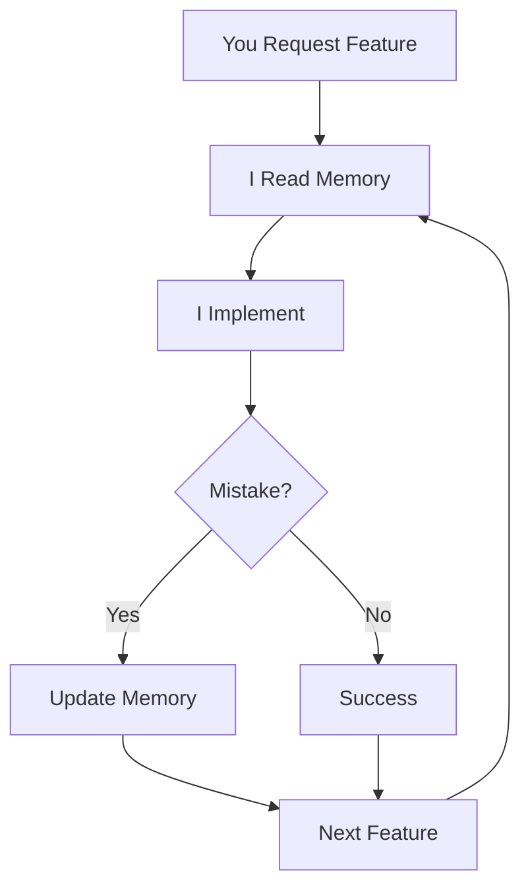

# Agent Config
root: .agent
skills: .agent/skills

# 🚀 AntiGravity Agents Guide: Mastering the Ecosystem

You have built a specialized ecosystem of agents. To extract 100% of its potential, you must interact with it following the "AntiGravity Pro" workflow.

## 🧠 Autonomous Specialist Skills

With the v1.20.5 update, AntiGravity has moved from manual slash commands to an **Autonomous Skill-based ecosystem**. I now recognize your objectives and proactively invoke the necessary specialist skills from `.agent/skills/`.

| Specialist | Domain | Proactive Activity |
| :--- | :--- | :--- |
| **Nexus** | Orchestration | Coordinates the entire lifecycle and manages project memory. |
| **Planner** | Strategy | Analyzes requirements and creates the `implementation_plan.md`. |
| **Task Manager** | Organization | Decomposes plans into executable units in `task.md`. |
| **Reviewer** | Audit | Validates code against rules and creates the `walkthrough.md`. |

---

## 🔄 The Perfect Development Cycle

To guarantee 100% quality, ask me to follow these phases:

### 1. Strategic Phase (Planner)
> **You say:** "I want to add a real-time notification system."
- **What happens:** I autonomously invoke the **Planner** skill. I will analyze your rules and memory before creating a detailed `implementation_plan.md`. **Do not settle for anything less than a solid plan here.**

### 2. Breakdown Phase (Task Manager)
> **You say:** "Break this plan into micro-tasks."
- **What happens:** I invoke the **Task Manager** skill to create a `task.md`. This prevents me from getting lost in long tasks and ensures you track progress in real-time.

### 3. Execution Phase (Nexus)
- **What happens:** I execute the tasks from `task.md` one by one. **Autonomous flows** are now enabled by default (v1.20.5), meaning I will proactively manage tool chain execution. I **always** read the `.agent/rules/` and relevant skills before each new file.

### 4. Audit Phase (Reviewer)
> **You say:** "Review what has been done so far."
- **What happens:** The **Reviewer** skill steps in with a critical eye, ensuring the implementation didn't deviate from the original plan and respects the style rules.

---

## 💡 Expert Tips

1.  **Rules are Alive:** If you notice me forgetting something (e.g., "Always use Tailwind"), don't just tell me in the chat. **Ask me to update the corresponding `rules` file.** This makes the learning permanent.
2.  **Context is King:** Before starting a large task, you can say: "Nexus, read all our rules and workflows before starting." This "warms up" the agent's context.
3.  **Use `walkthrough.md`:** At the end of each delivery, ask for a walkthrough. It serves as automatic documentation of what was done and how to test it.
4.  **Feed the Memory:** When I make a mistake or we reach a significant milestone, ask me to update `.agent/memory.md`. This creates a self-learning cycle where errors are never repeated.
5.  **Leverage Tools:** Use scripts in `.agent/tools/scripts/` for automation. I check these automatically before manual execution.
6.  **Autonomous Orchestration (v1.20.5):** You no longer need to use `/` commands. Simply state your goal (e.g., "Nexus, start a new feature"), and I will autonomously coordinate the specialist skills.

---

## 🧠 The Memory System

AntiGravity learns from experience through `.agent/memory.md`:

### What Goes in Memory?
- **Architectural Decisions:** "We chose Feature-Based architecture for modularity"
- **Lessons Learned:** "Forgot 'use client' in interactive components - always check"
- **Tech Stack Choices:** "Using Zustand instead of Redux for simplicity"
- **Anti-Patterns:** "Avoid God Components - extract logic to hooks"

### How to Use Memory

**Option 1: Ask me directly**
> "Add to memory: we decided to use Supabase RLS instead of API-level auth for better security"

**Option 2: Let workflows handle it**
The `/reviewer` workflow automatically updates memory when critical issues are found.

**The Result:** I read memory before every significant task, preventing repeated mistakes and maintaining architectural consistency.

---

## 🛠️ The Tools System

Extend agent capabilities with custom scripts in `.agent/tools/`:

### When to Create a Tool
- Repetitive tasks (syncing types, running migrations)
- Complex commands that need specific parameters
- Project-specific automation

### How to Use Tools

**Step 1: Create the script**
```bash
# .agent/tools/scripts/sync-db-types.sh
#!/bin/bash
npx supabase gen types typescript --local > src/types/database.ts
```

**Step 2: Reference in a rule**
```markdown
# In .agent/rules/rules-tech-typescript.md
- After any database schema change, run `.agent/tools/scripts/sync-db-types.sh`
```

**Step 3: Automatic execution**
I'll now run this script automatically whenever I detect a schema change.

---

## 🔄 The Self-Learning Cycle

Here's how AntiGravity evolves:


```mermaid
graph TD
    A[You Request Feature] --> B[I Read Memory]
    B --> C[I Implement]
    C --> D{Mistake?}
    D -->|Yes| E[Update Memory]
    D -->|No| F[Success]
    E --> G[Next Feature]
    F --> G
    G --> B
```

**Real Example:**
1. I forget to add `'use client'` to a component (mistake)
2. You point it out, I update `memory.md`
3. Next component: I read memory first, remember the lesson
4. No more `'use client'` mistakes ✅


---

## 🎯 The Ultimate Goal
This system was designed so you can focus on the **"WHAT"** (the product) while the agents take care of the **"HOW"** (the technique, standards, quality) automatically and consistently.
