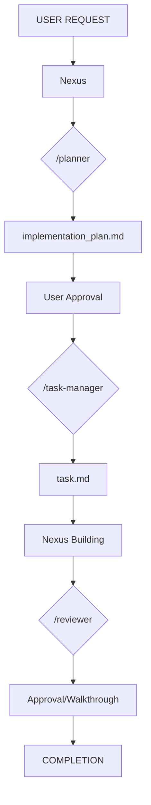
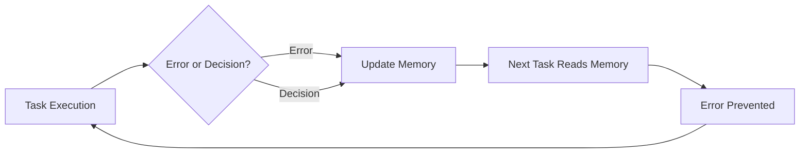

# AntiGravity 🌌

> [!TIP]
> **🚀 New to AntiGravity?** Check out the [Agents Workflow Guide](AGENTS.md) to learn how to orchestrate your agents and ensure 100% quality.

AntiGravity is a cutting-edge **Agentic Workflow Orchestration System** designed to streamline and standardize the software development lifecycle using specialized AI agents.

## 🏗️ Architecture & Orchestration

AntiGravity prevents "context drift" and "code rot" by using a primary orchestrator and a fleet of specialized sub-agents:

### 1. Nexus (The Architect & Builder)
The heart of the system. Nexus coordinates the entire workflow, manages communication, and leads technical implementation.

### 2. Specialized Sub-agents
- **`/planner`**: Analyzes requirements and generates a comprehensive `implementation_plan.md`.
- **`/task-manager`**: Breaks down approved plans into atomic, testable units in `task.md`.
- **`/reviewer`**: Audits the code against strict quality, security, and architectural rules defined in `.agent/rules/`.

## 🔄 The 4-Phase Workflow

Every feature implementation follows a strict sequence:



## ✅ Quality Guarantees

Each implementation ensures:
- ✅ **Architectural Alignment:** Follows patterns in `.agent/rules/`
- ✅ **Type Safety:** 100% TypeScript compliance
- ✅ **Plan Integrity:** No "shadow features" or skipped steps
- ✅ **Review History:** Full documentation of decisions in `implementation_plan.md` and `walkthrough.md`
- ✅ **Self-Learning:** Mistakes are captured in `memory.md` to prevent recurrence

## 🔄 The Self-Learning Cycle

AntiGravity continuously improves through experience:



**How it works:**
1. Agent makes a mistake or you make an architectural decision
2. `memory.md` is updated with the lesson or rationale
3. Future tasks read memory before starting
4. Same mistake is never repeated

---


## 🏛️ The 5 Pillars of AntiGravity

AntiGravity is built on five interconnected systems that work together to create a self-improving development environment:

### 1. 📜 Rules (`.agent/rules/`)
**Technical standards and coding conventions** that agents must follow.
- Language-specific patterns (React, TypeScript, Go)
- Architecture guidelines (Clean Code, Design Patterns)
- UI/UX standards (HSL colors, accessibility)

**Example:** `rules-tech-react.md` enforces Feature-Based architecture and functional components.

### 2. 🎓 Skills (`.agent/skills/`)
**Domain expertise** that agents can invoke for specialized tasks.
- Backend Expert (API design, security)
- React Expert (component patterns, performance)
- System Architecture Expert (scalability, design)

**Example:** When building a REST API, the Backend Expert skill provides guidance on error handling and validation.

### 3. 🔄 Workflows (`.agent/workflows/`)
**Orchestrated processes** for complex tasks using slash commands.
- `/planner` - Strategic planning and architecture
- `/task-manager` - Task breakdown and organization
- `/reviewer` - Code quality audits

**Example:** `/nexus` orchestrates the entire feature development lifecycle.

### 4. 🛠️ Tools (`.agent/tools/`)
**Scripts and utilities** that extend agent capabilities.
- Automation scripts for repetitive tasks
- Custom build or deployment tools
- Project-specific utilities

**Example:** A script to sync Supabase types or run database migrations.

### 5. 🧠 Memory (`.agent/memory.md`)
**Persistent context** that agents remember across conversations.
- Architectural decisions and rationale
- Lessons learned from past mistakes
- Project-specific conventions

**Example:** "We use Zustand instead of Redux for simplicity" prevents future debates.

---

## 📁 Project Structure

```text
.agent/
├── memory.md       # Persistent context and lessons learned
├── rules/          # Technical standards (React, TS, Go, Clean Code)
├── skills/         # Domain experts (Backend, React, Architecture)
├── tools/          # Scripts and utilities
│   ├── README.md
│   └── scripts/    # Automation scripts
└── workflows/      # Slash commands (/planner, /reviewer, /nexus)
.agentignore        # Files to exclude from agent context
```

---

## 🔒 Context Management

**`.agentignore`** controls what agents can access:
- Excludes sensitive files (`.env`, secrets)
- Ignores build artifacts and dependencies
- Keeps agent context focused and secure

**Pro Tip:** Use `!.env.example` to allow agents to see environment structure without exposing values.


## 📊 Success Metrics

- **Planning time:** ~5-10 min for complex features
- **Review quality:** 100% adherence to project-defined rules
- **Dev Velocity:** Increased by automating repetitive boilerplate and review tasks
- **Learning Rate:** Mistakes documented in memory are never repeated
- **Onboarding:** New team members productive in hours, not days

## 🚀 Quick Start

New to AntiGravity? Here's your 5-minute start:

1. **Read the guides:**
   - [AGENTS.md](AGENTS.md) - Master the workflow
   - [QUICKSTART.md](QUICKSTART.md) - Your first feature

2. **Try a command:**
   ```
   /planner Create a user authentication system
   ```

3. **Let the system guide you** through planning → tasks → implementation → review


## 🔄 Maintaining Agents (Sync)

To keep your agents updated with the latest organizational standards (from `antigravity-setup`), you can add this to your `Makefile`:

```makefile
.PHONY: agents
agents:
	@bash -c "$$(curl -fsSL https://raw.githubusercontent.com/joaopdmota/antigravity-setup/main/scripts/sync-agents.sh)" 
```

Then simply run:

```bash
make agents
```

---

**AntiGravity:** *Taking the weight off software development.*
