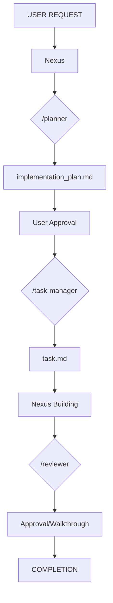

# AntiGravity 🌌

> [!TIP]
> **🚀 New to AntiGravity?** Check out the [Agents Workflow Guide](AGENTS.md) to learn how to orchestrate your agents and ensure 100% quality.

AntiGravity is a cutting-edge **Agentic Workflow Orchestration System** designed to streamline and standardize the software development lifecycle using specialized AI agents.

## 🏗️ Architecture & Orchestration

AntiGravity prevents "context drift" and "code rot" by using a primary orchestrator and a fleet of specialized sub-agents:

### 1. Nexus (The Architect & Builder)
The heart of the system. Nexus coordinates the entire workflow, manages communication, and leads technical implementation.

### 2. Specialized Sub-agents
- **`/planner`**: Analyzes requirements and generates a comprehensive `implementation_plan.md`.
- **`/task-manager`**: Breaks down approved plans into atomic, testable units in `task.md`.
- **`/reviewer`**: Audits the code against strict quality, security, and architectural rules defined in `.agent/rules/`.

## 🔄 The 4-Phase Workflow

Every feature implementation follows a strict sequence:



## ✅ Quality Guarantees

Each implementation ensures:
- ✅ **Architectural Alignment:** Follows patterns in `.agent/rules/`.
- ✅ **Type Safety:** 100% TypeScript compliance.
- ✅ **Plan Integrity:** No "shadow features" or skipped steps.
- ✅ **Review History:** Full documentation of decisions in `implementation_plan.md` and `walkthrough.md`.

## 📁 Project Structure

```text
.agent/
├── rules/          # Project-specific coding standards (React, TS, Styling)
├── skills/         # Domain experts taught to apply the rules (React Expert, System Architect...)
└── workflows/      # Orchestration logic for slash commands (/planner, /reviewer...)
    ├── nexus.md    # Main orchestrator
    ├── planner.md  # Strategic planning
    └── ...
```

## 📊 Success Metrics
- **Planning time:** ~5-10 min for complex features.
- **Review quality:** 100% adherence to project-defined rules.
- **Dev Velocity:** Increased by automating repetitive boilerplate and review tasks.

## 🔄 Maintaining Agents (Sync)

To keep your agents updated with the latest organizational standards (from `antigravity-setup`), you can add this to your `Makefile`:

```makefile
.PHONY: agents
agents:
	@bash -c "$$(curl -fsSL https://raw.githubusercontent.com/joaopdmota/antigravity-setup/main/scripts/sync-agents.sh)" 
```

Then simply run:

```bash
make agents
```

---

**AntiGravity:** *Taking the weight off software development.*
